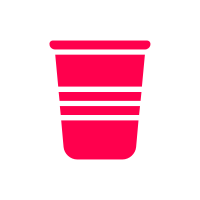

## Résumé

I’ve been working with iOS since its release in 2008 and macOS before that. Here is some of my past work. Some were full time jobs, some were for clients, and some were my own projects.

<ul class="apps">
  <li>
    <a href="https://itunes.apple.com/app/bible/id282935706?mt=8&uo=4&at=1l3vmtU" rel="external nofollow">
      
      Bible
    </a>
  </li>
  <li>
    <a href="https://github.com/mobile" rel="external nofollow">
      
      GitHub
    </a>
  </li>
  <li>
    <a href="https://lyft.com/" rel="external nofollow">
      
      Lyft
    </a>
  </li>
  <li>
    <a href="https://lyft.com/driver" rel="external nofollow">
      
      Lyft Driver
    </a>
  </li>
  <li class="mac">
    <a href="https://usecontrast.com" rel="external nofollow">
      
      Contrast
    </a>
  </li>
  <li>
    <a href="https://along.video" rel="external nofollow">
      
      Along
    </a>
  </li>
  <li>
    <a href="https://venmo.com/" rel="external nofollow">
      
      Venmo
    </a>
  </li>
  <li>
    <a href="https://itunes.apple.com/app/hipstamatic/id342115564?mt=8&uo=4&at=1l3vmtU" rel="external nofollow">
      
      Hipstamatic
    </a>
  </li>
  <li>
    <a href="https://itunes.apple.com/app/litely/id850707754?mt=8&amp;uo=4&amp;at=1l3vmtU" rel="external nofollow">
      
      Litely
    </a>
  </li>
  <li>
    <a href="https://joinhouse.party" rel="external nofollow">
      
      Houseparty
    </a>
  </li>
  <li>
    <a href="https://itunes.apple.com/app/over/id535811906?mt=8&amp;uo=4&amp;at=1l3vmtU" rel="external nofollow">
      
      Over
    </a>
  </li>
  <li>
    <a href="https://soffes.blog/parting-ways-with-cheddar" rel="external">
      
      Cheddar
    </a>
  </li>
  <li>
    <a href="https://github.com/usecanvas/ios-v1" rel="external nofollow">
      
      Canvas
    </a>
  </li>
  <li>
    <a href="https://medium.com/@kevinrose/we-re-shutting-down-tiiny-14254524f9b6" rel="external nofollow">
      
      Tiiny
    </a>
  </li>
  <li>
    <a href="https://soffes.blog/shares-2" rel="external">
      
      Shares
    </a>
  </li>
  <li>
    <a href="https://blog.ghost.org/roon" rel="external nofollow">
      
      Roon
    </a>
  </li>
  <li>
    <a href="https://itunes.apple.com/app/incredibooth/id378754705?mt=8&amp;uo=4&amp;at=1l3vmtU" rel="external nofollow">
      
      IncrediBooth
    </a>
  </li>
  <li>
    <a href="https://soffes.blog/onward" rel="external">
      
      Seesaw
    </a>
  </li>
  <li class="mac">
    <a href="http://usewhiskey.com" rel="external nofollow">
      
      Whiskey
    </a>
  </li>
  <li class="mac">
    <a href="https://useredacted.com" rel="external nofollow">
      
      Redacted
    </a>
  </li>
</ul>

### Experience

Started working with iOS day one and released an app the first day of the App Store. Released several Swift, Ruby, and Objective-C open source libraries & contributed to several others. Expertise in custom UI, text, graphics, image processing, camera capture, and networking.

### Work History

#### Staff Software Engineer (2024–Present) @ [Apple](https://apple.com) — San Francisco, CA

Working on the Podcasts app across all of Apple’s platforms.

#### Sabbatical (2022-2023) — Sausalito, CA

Converted a cargo van into a camper van to live and travel in during [2022](/2022). Became a scuba diving instructor and spent time learning more about creating physical products.

#### Co-founder & CTO (2020-2021) @ [Along](https://along.video) — San Francisco, CA

Led engineering on iOS, API, and web for social video application. Created video encoding pipeline that allowed for video edits without re-encoding.

#### Staff iOS Engineer (2020) @ [GitHub](https://github.com) — San Francisco, CA

Led engineering on iOS tooling.

#### Staff iOS Engineer (2017–2020) @ [Lyft](https://lyft.com) — San Francisco, CA

Led engineering on design systems and created internal tools for mobile infrastructure. Worked on cross-functional products for drivers and riders.

#### iOS Engineer (2015–2016) @ Canvas — San Francisco, CA

Worked on native iOS & macOS realtime, collaborative Markdown text editor using operational transformations.

#### iOS Engineer (2015) @ [Venmo](https://venmo.com) — San Francisco, CA

Worked on improving the Venmo iOS application. Led development on various internal tools.

#### Founder (2012–2021) @ Nothing Magical — San Francisco, CA

Worked on self-funded company to launch iOS and web applications.  Litely, a client project, was featured as Editor's Choice in the App Store. Worked intermittently as a freelancer as well.

#### VP of Engineering (2012–2013) @ Seesaw — San Francisco, CA

First employee. Led mobile and web engineering on multiple social products.

#### Lead iOS Engineer (2011–2012) @ [Hipstamatic](https://hipstamatic.com) — San Francisco, CA

First employee. Led iOS and API engineering on multiple social products.

#### Software Engineer (2011) @ [Scribd](https://scribd.com) — San Francisco, CA

Worked on team to create iPhone mobile reading application. Worked with recruiting to hire several additional iOS engineers.

#### Freelancer (2009–2010) — Dallas, TX

Led development on several client iOS and Ruby on Rails applications.

#### Digerati Polymath (2007–2009) @ [Life.Church](https://life.church) — Edmond, OK

Worked on Bible app for iPhone launching day one of the App Store. Worked on team to create backing web platform now with over 615 million users world wide.

#### Co-founder (2007–2009) @ Trimonix

Created and distributed macOS applications for working with video in live applications. Acquired 2009.

---

Feel free to email me at [sam@soff.es](mailto:sam@soff.es) or read more [about me](/about). 👋

I also have a [scuba diving resume](/resume/scuba) 🤿

Last updated 11/6/2024</gray>
